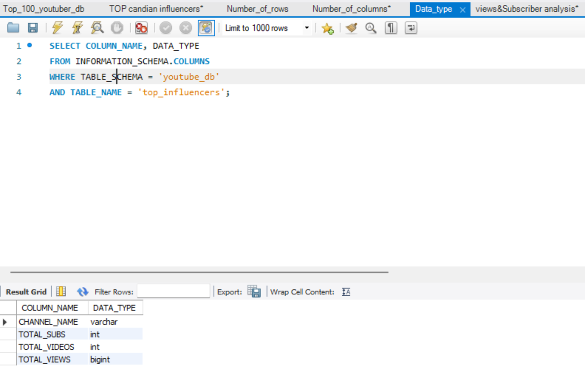

# Data Portfolio: Excel to Power BI 


# Table of contents 

- [Objective](#objective)
- [Data Source](#data-source)
- [Stages](#stages)
- [Design](#design)
  - [Mockup](#mockup)
  - [Tools](#tools)
- [Development](#development)
  - [Pseudocode](#pseudocode)
  - [Data Exploration](#data-exploration)
  - [Data Cleaning](#data-cleaning)
  - [Create the SQL View](#create-the-sql-view)
- [Testing](#testing)
  - [Data Quality Tests](#data-quality-tests)
- [Visualization](#visualization)
  - [Results](#results)
  - [DAX Measures](#dax-measures)
- [Analysis](#analysis)
  - [Findings](#findings)
  - [Validation](#validation)
  - [Discovery](#discovery)
- [Recommendations](#recommendations)
  - [Potential ROI](#potential-roi)
  - [Potential Courses of Actions](#potential-courses-of-actions)
- [Conclusion](#conclusion)


# Objective 

- What is the key pain point? 

The Head of Marketing wants to find out who the top YouTubers are to decide on which YouTubers would be best to run marketing campaigns throughout the rest of the year.


- What is the ideal solution? 

To create a dashboard that provides insights into the top Candian YouTubers that includes their 
- subscriber count
- total views
- total videos, and
- engagement metrics

This will help the marketing team make informed decisions about which YouTubers to collaborate with for their marketing campaigns.

## User story 

As the Head of Marketing, I want to use a dashboard that analyses YouTube channel data in Canada . 

This dashboard should allow me to identify the top performing channels based on metrics like subscriber base and average views. 

With this information, I can make more informed decisions about which Youtubers are right to collaborate with, and therefore maximize how effective each marketing campaign is.


# Data source 

- What data is needed to achieve our objective?

We need data on the top UK YouTubers in 2024 that includes their 
- channel names
- total subscribers
- total views
- total videos uploaded


- Where is the data coming from? 
The data is sourced from Kaggle (an Excel extract), [see here to find it.](https://www.kaggle.com/datasets/bhavyadhingra00020/top-100-social-media-influencers-2024-countrywise?resource=download)


# Stages

- Design
- Developement
- Testing
- Analysis 
 


# Design 

## Dashboard components required 
- What should the dashboard contain based on the requirements provided?

To understand what it should contain, we need to figure out what questions we need the dashboard to answer:

1. Who are the top 10 YouTubers with the most subscribers?
2. Which 3 channels have uploaded the most videos?
3. Which 3 channels have the most views?
4. Which 3 channels have the highest average views per video?
5. Which 3 channels have the highest views per subscriber ratio?
6. Which 3 channels have the highest subscriber engagement rate per video uploaded?

For now, these are some of the questions we need to answer, this may change as we progress down our analysis. 


## Dashboard mockup

- What should it look like? 

Some of the data visuals that may be appropriate in answering our questions include:

1. Table
2. Treemap
3. Scorecards
4. Horizontal bar chart 


## Tools 


| Tool | Purpose |
| --- | --- |
| Excel | Exploring the data |
| SQL Server | Cleaning, testing, and analyzing the data |
| Power BI | Visualizing the data via interactive dashboards |
| GitHub | Hosting the project documentation and version control |
| Mokkup AI | Designing the wireframe/mockup of the dashboard | 


# Development

## Pseudocode

- What's the general approach in creating this solution from start to finish?

1. Get the data
2. Explore the data in Excel
3. Load the data into SQL Server
4. Clean the data with SQL
5. Test the data with SQL
6. Visualize the data in Power BI
7. Generate the findings based on the insights
8. Write the documentation + commentary
9. Publish the data to GitHub Pages

## Data exploration notes

This is the stage where you have a scan of what's in the data, errors, inconcsistencies, bugs, weird and corrupted characters etc  


- What are your initial observations with this dataset? What's caught your attention so far? 

1. There are at least 4 columns that contain the data we need for this analysis, which signals we have everything we need from the file without needing to contact the client for any more data. 
2. The first column contains the channel ID with what appears to be channel IDS, which are separated by a @ symbol - we need to extract the channel names from this.
3. Some of the cells and header names are in a different language - we need to confirm if these columns are needed, and if so, we need to address them.
4. We have more data than we need, so some of these columns would need to be removed


## Data cleaning 
- What do we expect the clean data to look like? (What should it contain? What contraints should we apply to it?)

The aim is to refine our dataset to ensure it is structured and ready for analysis. 

The cleaned data should meet the following criteria and constraints:

- Only relevant columns should be retained.
- All data types should be appropriate for the contents of each column.
- No column should contain null values, indicating complete data for all records.

Below is a table outlining the constraints on our cleaned dataset:

| Property | Description |
| --- | --- |
| Number of Rows | 100 |
| Number of Columns | 4 |

And here is a tabular representation of the expected schema for the clean data:

| Column Name | Data Type | Nullable |
| --- | --- | --- |
| channel_name | VARCHAR | NO |
| total_subscribers | INTEGER | NO |
| total_views | INTEGER | NO |
| total_videos | INTEGER | NO |


- What steps are needed to clean and shape the data into the desired format?

1. Remove unnecessary columns by only selecting the ones you need
2. Extract Youtube channel names from the first column
3. Rename columns using aliases


### Create the SQL view 

```sql
/*
# 1. Create a view to store the transformed data
# 2. Cast the extracted channel name as VARCHAR(100)
# 3. Select the required columns from the top_uk_youtubers_2024 SQL table 
*/

-- 1.
CREATE VIEW youtube_db.top_influencers AS

-- 2.
SELECT
     CHANNEL_NAME,
     TOTAL_VIEWS,
     TOTAL_VIDEOS,
     TOTAL_SUBS

-- 3.
FROM
    youtube_db.influencers

```


# Testing 

- What data quality and validation checks are you going to create?

Here are the data quality tests conducted:

## Row count check
```sql
/*
# Count the total number of records (or rows) are in the SQL view
*/

select 
     count(*) as Number_of_row
from
      youtube_db.top_influencers;

```


## Column count check
### SQL query 
```sql
/*
# Count the total number of columns (or fields) are in the SQL view
*/


SELECT 
      COUNT(*)  Number_of_columns
FROM 
     INFORMATION_SCHEMA.COLUMNS  
WHERE 
     TABLE_SCHEMA = 'youtube_db'  
      AND TABLE_NAME = 'top_influencers';
```
### Output 


## Data type check
### SQL query 
```sql
/*
# Check the data types of each column from the view by checking the INFORMATION SCHEMA view
*/

-- 1.
SELECT 
      COLUMN_NAME,
      DATA_TYPE  
FROM 
     INFORMATION_SCHEMA.COLUMNS  
WHERE
      TABLE_SCHEMA = 'youtube_db'  
      AND TABLE_NAME = 'top_influencers';
```
### Output



## Duplicate count check
### SQL query 
```sql
/*
# 1. Check for duplicate rows in the view
# 2. Group by the channel name
# 3. Filter for groups with more than one row
*/


-- 1.
SELECT 
       CHANNEL_NAME, 
       COUNT(*) AS duplicate_count  
FROM 
    youtube_db.top_influencers 

--2 
GROUP BY 
        CHANNEL_NAME 

--3
HAVING 
      COUNT(*) > 1;
```
### Output


# Visualization 


## Results

- What does the dashboard look like?


This shows the Top Candian Youtubers so far. 


## DAX Measures

### 1. Total Subscribers (M)
```sql
Total_subscribers (M) = 
VAR Millions = 1000000
VAR sumofsubscribers = SUM(cleaned_top100_canadian_youtubers[TOTAL_SUBS])
VAR totalsubscribers = DIVIDE(sumofsubscribers, Millions)

RETURN totalsubscribers

```

### 2. Total Views (B)
```sql
Total_views (B) = 
VAR billion = 1000000000
VAR sumoftoyalviews = SUM(cleaned_top100_canadian_youtubers[TOTAL_VIEWS])
VAR totalviews = DIVIDE(sumoftoyalviews, billion)

RETURN totalviews

```

### 3. Total Videos
```sql
Total_vids = 
VAR totalvideos = SUM(cleaned_top100_canadian_youtubers[TOTAL_VIDEOS])

RETURN totalvideos

```

### 4. Average Views Per Video (M)
```sql
Avg_views_Per/video (M) = 
VAR sumoftotalviews = SUM(cleaned_top100_canadian_youtubers[TOTAL_VIEWS])
VAR sumoftotalvideos = SUM(cleaned_top100_canadian_youtubers[TOTAL_VIDEOS])
VAR averageviewsPervideo = DIVIDE(sumoftotalviews, sumoftotalvideos, BLANK())
VAR finalaverageviewsPervideo = DIVIDE(averageviewsPervideo, 1000000, BLANK())

RETURN finalaverageviewsPervideo

```


### 5. Subscriber Engagement Rate
```sql
Subscriber_engagement_rate = 
VAR sumoftotalsubcribers = SUM(cleaned_top100_canadian_youtubers[TOTAL_SUBS])
VAR sumoftotalvideos = SUM(cleaned_top100_canadian_youtubers[TOTAL_VIDEOS])
VAR subscriberEngagementRate = DIVIDE(sumoftotalsubcribers, sumoftotalvideos, BLANK())

RETURN subscriberEngagementRate

```


### 6. Views per subscriber
```sql
viewsPerSubscriber = 
VAR sumoftotalviews = SUM(cleaned_top100_canadian_youtubers[TOTAL_VIEWS])
VAR sumoftotalsubscribers = SUM(cleaned_top100_canadian_youtubers[TOTAL_SUBS])
VAR viewsPerSubscriber = DIVIDE(sumoftotalviews, sumoftotalsubscribers,BLANK())

RETURN viewsPerSubscriber

```


# Analysis 

## Findings

- What did we find?

For this analysis, we're going to focus on the questions below to get the information we need for our marketing client - 

Here are the key questions we need to answer for our marketing client: 
1. Who are the top 10 YouTubers with the most subscribers?
2. Which 3 channels have uploaded the most videos?
3. Which 3 channels have the most views?
4. Which 3 channels have the highest average views per video?
5. Which 3 channels have the highest views per subscriber ratio?
6. Which 3 channels have the highest subscriber engagement rate per video uploaded?


### 1. Who are the top 10 YouTubers with the most subscribers?

| Rank | Channel Name         | Subscribers (M) |
|------|----------------------|-----------------|
| 1    | Justin Bieber        | 75.40           |
| 2    | Super Simple songs   | 44.30           |
| 3    | The weekend          | 37.90           |
| 4    | WatchMojo.com        | 25.80           |
| 5    | Linus Tech Tips      | 16.30           |
| 6    | Typical Gamer        | 15.70           |
| 7    | Hacksmith Industries | 15.30           |
| 8    | AzzyLand             | 13.00           |
| 9    | HZHtube Kids Fun     | 13.00           |
| 10   | MrsuicideSheep       | 12.90           |


### 2. Which 3 channels have uploaded the most videos?

| Rank | Channel Name     | Videos Uploaded |
|------|------------------|-----------------|
| 1    | Global News      | 45,751          |
| 2    | WatchMojo.com    | 29,881          |
| 3    | Step News Agency | 13,587          |


### 3. Which 3 channels have the most views?


| Rank | Channel Name                     | Total Views (B) |             
|------|----------------------------------|-----------------|
| 1    | Super Simple Songs -kids songs   | 56.38           |
| 2    | Justin Bieber                    | 34.86           |
| 3    | The Weekend                      | 32.12           |


### 4. Which 3 channels have the highest average views per video?

| Rank   | Channel Name              | Average Views per Video (M) |
|--------|---------------------------|-----------------------------|
| 1      | The WeekendSuper          | 160.59                      |
| 2      | Justin Bieber             | 140.00                      |
| 3      | Simple Songs -kids songs  | 670.37                      |


### 5. Which 3 channels have the highest views per subscriber ratio?

| Rank | Channel Name                   | Views per Subscriber        |
|------|--------------------------------|---------------------------- |
| 1    | Super Simple Songs -kids songs | 1272.64                     |
| 2    | Super Simple ABCs              | 970.05                      |
| 3    | SpyCakes                       | 961.60                      |


### 6. Which 3 channels have the highest subscriber engagement rate per video uploaded?

| Rank | Channel Name       | Subscriber Engagement Rate  |
|------|--------------------|---------------------------- |
| 1    | Justin Bieber      |  302,811.26                 |
| 2    | The Weeknd         |  189,500.00                 |
| 3    | Two Super Sister 2 |  165,217.39                 |


### Notes

For this analysis, we'll prioritize analysing the metrics that are important in generating the expected ROI for our marketing client, which are the YouTube channels wuth the most 

- subscribers
- total views
- videos uploaded


## Validation 

### 1. Youtubers with the most subscribers 

#### Calculation breakdown

Campaign idea = product placement 

1. Justin Bieber  
- Average views per video = 140 million
- Product cost = $11
- Potential units sold per video = 140 million x 4% conversion rate = 5,600,000 units sold
- Potential revenue per video = 5,600,000 x $11 = $61,600,000
- Campaign cost (one-time fee) = $6,000,000
- **Net profit = $61,600,000 - $6,000,000 = $55,600,000**

2. Super Simple songs - Kid songs

- Average views per video = 67.04 million
- Product cost = $11
- Potential units sold per video = 67.04 million x 4% conversion rate = 2,681,600 units sold
- Potential revenue per video = 2,681,600 x $11 = $29,497,600
- Campaign cost (one-time fee) = $6,000,000
- **Net profit = $29,497,600 - $6,000,000 = $23,497,600**

c. The weekend

- Average views per video = 160.06 million
- Product cost = $11
- Potential units sold per video = 160.06 million x 4% conversion rate = 6,402,400 units sold
- Potential revenue per video = 6,402,400 x $11 = $70,426,400
- Campaign cost (one-time fee) = $6,000,000
- **Net profit = $70,426,400 - $6,000,000 = $64,426,400**


Best option from category: The weekend


#### SQL query 

```sql
/* 

# 1. Define variables 
# 2. Create a CTE that rounds the average views per video 
# 3. Select the column you need and create calculated columns from existing ones 
# 4. Filter results by Youtube channels
# 5. Sort results by net profits (from highest to lowest)

*/


-- 1. 
SET @conversionRate = 0.04;  -- The conversation rate 4%
SET @productCost = 11.00; -- The product Cost @ 11 dollars
SET @campaignCost = 6000000.00; -- The Campaign cost @ 6 million 


-- 2.  
WITH channel_data AS (
    SELECT 
        CHANNEL_NAME,
        TOTAL_VIEWS,
        TOTAL_VIDEOS,
        ROUND(CAST(TOTAL_VIEWS AS FLOAT) / TOTAL_VIDEOS, -4) AS rounded_avg_views_per_videos
    FROM youtube_db.top_influencers
)

-- 3. 
SELECT 
CHANNEL_NAME,
rounded_avg_views_per_videos,
(rounded_avg_views_per_videos * @ConversionRate) as Potential_units_sold_per_video,
(rounded_avg_views_per_videos * @ConversionRate * @productCost) as Potential_revenue_per_video,
(rounded_avg_views_per_videos * @ConversionRate * @productCost) - @campaignCost as net_profit 

FROM channel_data


-- 4 & 5

ORDER BY TOTAL_VIEWS DESC
LIMIT 3;

```

#### Output


### 2.  Youtubers with the most views 

#### Calculation breakdown

Campaign idea = Influencer marketing 

a. Super Simple songs - Kid songs

- Average views per video = 67.04 million
- Product cost = $11
- Potential units sold per video = 67.04 million x 4% conversion rate = 2,681,600 units sold
- Potential revenue per video = 2,681,600 x $11 = $29,497,600
- Campaign cost (5-month fee) = $900,000
- **Net profit = $29,497,600 - $900,000 = $28,597,600**

b. Justin Bieber 
 
- Average views per video = 140 million
- Product cost = $11
- Potential units sold per video = 140 million x 4% conversion rate = 5,600,000 units sold
- Potential revenue per video = 5,600,000 x $11 = $61,600,000
- Campaign cost (5-month contract) = $900,000
- **Net profit = $61,600,000 - $900,000 = $60,100,000**


c. The weekend

- Average views per video = 160.06 million
- Product cost = $11
- Potential units sold per video = 160.06 million x 4% conversion rate = 6,402,400 units sold
- Potential revenue per video = 6,402,400 x $11 = $70,426,400
- Campaign cost (5-month fee) = $900,000
- **Net profit = $70,426,000 - $900,000 = $69,526,400**


Best option from category: The weekend


#### SQL query 
```sql
/*
# 1. Define variables
# 2. Create a CTE that rounds the average views per video
# 3. Select the columns you need and create calculated columns from existing ones
# 4. Filter results by YouTube channels
# 5. Sort results by net profits (from highest to lowest)
*/


-- 1.
SET @conversionRate = 0.04;  -- The conversation rate 4%
SET @productCost = 11.00; -- The product Cost @ 11 dollars
SET @campaignCost = 900000.00; -- The Campaign cost @ 900 thousand 


-- 2.
WITH channel_data AS (
    SELECT 
        CHANNEL_NAME,
        TOTAL_VIEWS,
        TOTAL_VIDEOS,
        ROUND(CAST(TOTAL_VIEWS AS FLOAT) / TOTAL_VIDEOS, -4) AS rounded_avg_views_per_videos,
        CEIL(TOTAL_VIEWS/TOTAL_VIDEOS) as original_avg_views_per_videos
    FROM youtube_db.top_influencers
)


-- 3.
SELECT 
CHANNEL_NAME,
rounded_avg_views_per_videos,
(rounded_avg_views_per_videos * @ConversionRate) as Potential_units_sold_per_video,
(rounded_avg_views_per_videos * @ConversionRate * @productCost) as Potential_revenue_per_video,
(rounded_avg_views_per_videos * @ConversionRate * @productCost) - @campaignCost as net_profit 

FROM channel_data

-- 4 & 5

ORDER BY TOTAL_VIEWS DESC
LIMIT 3;


```

#### Output


## Discovery

- What did we learn?

We discovered that 


1. Subscriber-heavy channels (Justin Bieber, Super Simple Songs, The Weeknd)
- High subscriber count suggests strong audience loyalty and lasting popularity.
- However, engagement depends on how often these subscribers actually watch videos. If views per subscriber are low, it could indicate passive fandom rather than active content consumption.
- Music channels often spike in engagement when new albums or singles drop, but sustained interaction can be tricky unless content is continuously refreshed (e.g., live performances, interviews, or behind-the-scenes content).
2. Most uploaded videos (Global News, WatchMojo.com, Step News Agency)
- News and entertainment channels thrive on frequent updates, meaning engagement can come from routine viewers rather than dedicated fans.
- Volume vs. depth: Channels that post often can have lower average engagement per video, since content gets spread across a wide catalog.
- If subscriber numbers are lower compared to views, it may indicate non-subscribers driving engagement—meaning people find their videos via search or recommendations rather than subscribing.
3. Most viewed channels (Super Simple Songs, Justin Bieber, The Weeknd)
- High view counts imply widespread audience reach, but the key question is who is watching—loyal fans or casual viewers?
- Super Simple Songs likely benefits from repeat watches (kids watching the same content multiple times), whereas artists like Justin Bieber and The Weeknd get spikes from major releases followed by potential drop-offs.
- Virality vs. retention: High views don’t always mean high engagement. If viewers don't comment, like, or subscribe, engagement remains shallow.


## Recommendations 

- What do you recommend based on the insights gathered? 
  
a. Prioritize The Weeknd for Campaigns
Both in terms of views and subscribers, The Weeknd offers the highest potential net profit and ROI for both influencer marketing and product placement campaigns. His audience is large, engaged, and his content consistently draws high viewership.
b. Consider Justin Bieber as a Strong Alternative
Justin Bieber also provides a high ROI, especially for influencer marketing, and has a massive, loyal fanbase. He’s a solid backup or secondary option if The Weeknd is unavailable or if you want to diversify.
c. Use Super Simple Songs for Family/Kids Products
While the net profit is lower, Super Simple Songs is ideal for products targeting families or children. The repeat viewership and high engagement from parents make it a good fit for certain brands.
d. Avoid High-Volume News/Entertainment Channels for Direct Sales
Channels like Global News or WatchMojo.com may have high upload frequency and views, but engagement is spread thin, and their audiences are less likely to convert for product sales.


### Potential ROI 
Certainly! Here’s a more **extensive analysis of the potential ROI** for each channel, including deeper insights into what drives the numbers, risk factors, and what could influence actual returns.

---

#### **Potential ROI: Detailed Analysis**

##### **1. The Weeknd**

###### **Influencer Marketing**
- **Net Profit:** $69,526,400  
- **Campaign Cost:** $900,000  
- **ROI:** 7,725%
- **Drivers:**  
  - Exceptionally high average views per video (160.06M).
  - Strong global fanbase, high engagement during album/single releases.
  - Music content is highly shareable and repeatable.
- **Risks:**  
  - Engagement may spike only during new releases.
  - Audience may be less receptive to non-music product placements.
  - Brand fit is crucial—misalignment can reduce conversion.

###### **Product Placement**
- **Net Profit:** $64,426,400  
- **Campaign Cost:** $6,000,000  
- **ROI:** 1,073%
- **Drivers:**  
  - High visibility, especially if integrated into music videos or behind-the-scenes content.
  - Potential for viral moments if the product is creatively featured.
- **Risks:**  
  - One-time fee is much higher, so campaign must be well-timed.
  - If the product placement is too subtle or not well-integrated, conversion may drop.

---

##### **2. Justin Bieber**

###### **Influencer Marketing**
- **Net Profit:** $60,100,000  
- **Campaign Cost:** $900,000  
- **ROI:** 6,678%
- **Drivers:**  
  - Massive, loyal subscriber base.
  - High average views (140M) per video.
  - Strong social media presence for cross-promotion.
- **Risks:**  
  - Audience may be younger, with less purchasing power for certain products.
  - Engagement can fluctuate based on public image and media coverage.

###### **Product Placement**
- **Net Profit:** $55,600,000  
- **Campaign Cost:** $6,000,000  
- **ROI:** 927%
- **Drivers:**  
  - High likelihood of trending content.
  - Potential for global reach.
- **Risks:**  
  - High upfront cost.
  - Product must resonate with Bieber’s brand and audience.

---

##### **3. Super Simple Songs**

###### **Influencer Marketing**
- **Net Profit:** $28,597,600  
- **Campaign Cost:** $900,000  
- **ROI:** 3,177%
- **Drivers:**  
  - Repeat viewership from children (high frequency of replays).
  - Parents are the buyers—potential for high conversion on family/kids products.
- **Risks:**  
  - Product must be child/family-appropriate.
  - Regulatory and ethical considerations for marketing to children.

###### **Product Placement**
- **Net Profit:** $23,497,600  
- **Campaign Cost:** $6,000,000  
- **ROI:** 392%
- **Drivers:**  
  - High trust from parents.
  - Opportunity for long-term brand loyalty if product is well-received.
- **Risks:**  
  - Lower overall reach compared to music megastars.
  - Must comply with strict advertising standards for children.

---

#### **Key Factors Influencing Actual ROI**

- **Conversion Rate Assumptions:**  
  The 4% conversion rate is optimistic; actual rates may vary by product, campaign quality, and audience fit.
- **Product-Channel Fit:**  
  ROI is maximized when the product aligns with the channel’s audience and content style.
- **Campaign Timing:**  
  Launching during high-engagement periods (album drops, holidays, etc.) can boost ROI.
- **Creative Execution:**  
  Well-integrated, authentic campaigns outperform generic ads.
- **Market Saturation:**  
  If the audience is frequently exposed to similar campaigns, conversion rates may drop.
- **Regulatory Risks:**  
  Especially for children’s content, compliance is critical to avoid legal issues.

---

#### **Summary Table**

| Channel             | Campaign Type     | Net Profit      | Cost         | ROI (%)  |
|---------------------|-------------------|-----------------|--------------|----------|
| The Weeknd          | Influencer        | $69,526,400     | $900,000     | 7,725    |
| The Weeknd          | Product Placement | $64,426,400     | $6,000,000   | 1,073    |
| Justin Bieber       | Influencer        | $60,100,000     | $900,000     | 6,678    |
| Justin Bieber       | Product Placement | $55,600,000     | $6,000,000   | 927      |
| Super Simple Songs  | Influencer        | $28,597,600     | $900,000     | 3,177    |
| Super Simple Songs  | Product Placement | $23,497,600     | $6,000,000   | 392      |

---

**In summary:**  
- The Weeknd offers the highest ROI, especially for influencer campaigns.
- Justin Bieber is a strong alternative with slightly lower, but still excellent, ROI.
- Super Simple Songs is best for family/kids products, with lower but still substantial ROI.
- Actual ROI will depend on campaign execution, product fit, and market conditions.


###  Action plan
To maximize the return on investment (ROI) from YouTube influencer and product placement campaigns, it is essential to strategically select channels that align with our brand goals, audience, and product offerings. Our analysis of top-performing YouTube channels—based on subscribers, views, and engagement—reveals clear opportunities for high-impact marketing initiatives. By focusing on channels with proven reach and engagement, and by tailoring our approach to each channel’s unique audience, we can optimize both immediate sales and long-term brand growth.

The following action steps outline our recommended approach to executing successful campaigns, ensuring that we leverage the strengths of each channel while mitigating potential risks and maximizing overall effectiveness.

a. Secure Partnership with The Weeknd
Initiate negotiations for both influencer marketing and product placement.
Prepare creative concepts that align with his brand and audience.
Plan for campaign launches around new music releases for maximum engagement.
b. Develop a Contingency Plan with Justin Bieber
Reach out to his management as a secondary option.
Tailor campaign messaging to his audience’s interests and engagement patterns.
c. Target Super Simple Songs for Family/Kids Products
Design campaigns specifically for parents and children.
Leverage the channel’s repeat viewership for ongoing product exposure.
d. Monitor Engagement Metrics
Track not just views, but likes, comments, and shares to gauge true engagement.
Adjust campaign spend and creative based on real-time performance data.
e. Avoid Over-Saturating with News/Entertainment Channels
Use these channels for brand awareness, not direct sales.
Focus on short, high-impact campaigns rather than long-term product placements.
